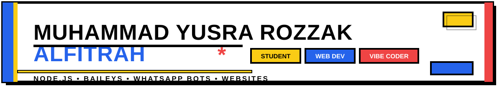

  🎓 Student | 💻 Web Developer | ✨ Vibe Coder | 🤖 Bot Developer (Node.js)

  
  
  

## Tech Stack

  
  
  
  
  
  
  
  
  

## Featured Project

🧅 **[Onigi-Baileys](https://github.com/OktzO/Onigi)** — WhatsApp bot library, full rebase onto Baileys `7.0.0-rc14` with MIT-licensed native Rust E2EE (`oktz-signal`), multimedia pipeline (ffmpeg/sharp/audio), and Rich WebUI (inline HTML inside chat bubbles). Collaboration with [@OktzO](https://github.com/OktzO).

## Websites I've Built

  
  
  

## Currently Building

WhatsApp bots, web apps & APIs, and security audits — learning in public, one commit at a time.

## GitHub Statistics

  
  

  

  <picture>
    <source media="(prefers-color-scheme: dark)" srcset="https://raw.githubusercontent.com/rozzak2009/rozzak2009/output/github-contribution-grid-snake-dark.svg" />
    <source media="(prefers-color-scheme: light)" srcset="https://raw.githubusercontent.com/rozzak2009/rozzak2009/output/github-contribution-grid-snake.svg" />
    
  </picture>

---

  Neobrutalism slim theme — blue / yellow / white / red. Built with Node.js energy.

